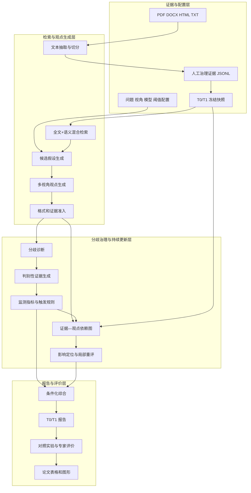
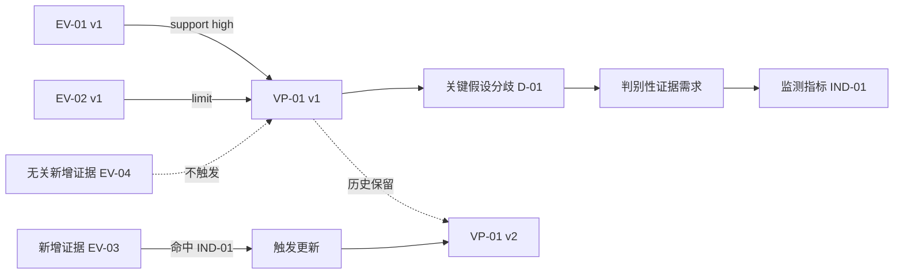

# 分歧驱动的国防科技情报持续研判：最小可运行研究原型实现设计

> 文档用途：交给代码模型或开发人员实现论文案例原型。本文档定义研究业务规则、数据结构、运行流程、人工检查点、对照实验和论文图表，不预设案例结论，也不编造阈值或实验结果。
>
> 建议实现顺序：先完成命令行版研究流水线，再考虑界面。论文案例不需要建设生产级多智能体平台。

## 0. 一页结论

本项目实现的不是一个通用“多智能体聊天系统”，而是一条可审计的持续研判流水线：

1. 冻结时点 \(T_0\) 的共享证据快照；
2. 基于同一证据快照独立提出并冻结竞争性假设；
3. 多个专业视角分别评价全部假设，形成结构化观点对象；
4. 对观点进行证据准入、交叉质疑和分歧分类；
5. 将高影响且暂不能消除的分歧转化为判别性证据、监测指标和触发规则；
6. 形成“当前主判断＋备择判断＋成立条件＋转换条件＋监测清单”的 \(T_0\) 报告；
7. 加入时点 \(T_1\) 的新证据，通过显式依赖、触发规则和兜底相关性扫描定位受影响观点；
8. 只对受影响观点生成新版本，保存修改原因和历史状态，形成 \(T_1\) 更新报告；
9. 与普通多智能体综合生成方法比较分歧透明度、监测行动性、影响定位和更新可追溯性。

现成组件负责文档抽取、语义检索、结构化输出、数据库、制图和报告渲染；需要本文自己实现的只有四类业务逻辑：

- 观点准入与状态管理；
- 分歧对象及其分类处置；
- “分歧—判别性证据—监测指标—转换条件”的映射；
- “证据变化—受影响观点—观点新版本”的传播规则。

## 1. 研究目标与实现边界

### 1.1 原型要证明什么

原型不以证明“模型预测一定正确”为目标，而要验证以下研究命题是否具有过程证据：

- 在相同证据条件下，方法能否保留有依据的备择判断，同时过滤无证据意见；
- 能否明确指出分歧发生在事实、范围、机制、关键假设还是风险权重层面；
- 能否把尚未解决的关键分歧转化为可观察的判别性证据和后续监测任务；
- 新证据出现后，能否定位需要修改的观点，避免整份报告无差别重写；
- 专家是否认为输出比单一综合结论更具解释性、预警价值和行动价值。

### 1.2 原型不做什么

- 不训练新大模型，不微调基础模型；
- 不建设复杂知识图谱平台；
- 不自动判定所有公开资料的真实性；
- 不以模型置信度代替专家判断；
- 不保存或要求模型输出隐藏思维链，只保存简明论证、证据标识和结构化字段；
- 不做生产级并发、权限、前端、容灾和涉密系统适配；
- 不把框架、数据库、向量检索或版本控制本身写成论文创新。

### 1.3 案例问题的建议表达

建议把“军用人工智能领域的发展”收缩为同一判断维度下的问题：

> 在给定公开证据时点和未来三至五年观察窗口内，军用人工智能能力建设将主要呈现何种能力形成与应用演进形态？不同判断分别依赖哪些关键条件，出现哪些新信号时需要调整当前研判？

最终的竞争性假设不能预先手工写死。应使用 \(T_0\) 证据，由专家和智能体独立提出候选项，完成去重、层级校准和可证伪性检查后冻结。实现中应允许假设数量为 2～5 项，具体数量由案例证据决定。

## 2. 总体方法与人机边界

### 2.1 研究闭环


### 2.2 四个人工确认点

系统必须在人机边界处暂停并等待人工确认。不得由模型自动越过以下节点：

| 检查点 | 人工任务 | 产物 |
|---|---|---|
| G1 证据快照确认 | 删除无关材料，确认来源、时间、证据等级和时点归属 | 冻结的 `snapshot_t0` / `snapshot_t1` |
| G2 假设集合冻结 | 检查同层级、可区分、可检验、结果相关性，避免后验挑选 | `hypotheses_frozen.json` |
| G3 高影响分歧与监测规则确认 | 审核判别性、可观察性、来源可获得性和触发方向 | `monitor_plan_approved.json` |
| G4 报告与版本签发 | 确认主判断、备择判断、风险表达和修改原因 | 签发报告与审计记录 |

### 2.3 智能体不是假设

每个专业视角都要评价全部竞争性假设，不能把“技术智能体”固定为支持假设 A、“应用智能体”固定为支持假设 B。建议设置四类视角：

1. 技术能力视角：算法、算力、数据、模型能力、测试评价；
2. 工程与产业视角：工程化、供应链、成本、研发生产和保障体系；
3. 作战应用与体系视角：任务适配、人机协同、跨平台集成和组织运用；
4. 可信治理视角：安全、可靠性、可解释性、试验鉴定、伦理和授权边界。

视角名称和数量可由案例调整，但同一次对照实验必须固定。

## 3. 最小技术架构

### 3.1 架构原则

- 采用普通 Python 状态机显式编排，不依赖重型多智能体框架；
- 所有中间对象落盘，任一步骤都能单独重跑；
- 大模型仅通过统一 `ModelClient` 调用，便于更换商业模型、开源模型或兼容接口；
- 结构化对象使用 JSON Schema 校验；
- 数据库采用追加式记录，不允许覆盖历史证据或观点版本；
- 检索与生成分开，报告中的每条关键论断都必须引用证据标识；
- 运行配置、模型版本、参数、提示模板哈希和证据快照哈希全部写入清单。

### 3.2 四层实现架构



### 3.3 推荐技术栈

| 功能 | 推荐实现 | 是否影响论文创新 |
|---|---|---|
| 语言与编排 | Python 3.11+，普通函数与显式状态机 | 否 |
| 对象校验 | Pydantic v2 或等价 JSON Schema 工具 | 否 |
| 元数据与版本 | SQLite；全文检索可用 FTS5 | 否 |
| PDF/DOCX 抽取 | PyMuPDF、python-docx；扫描件人工 OCR 后导入 | 否 |
| 中文切分 | 规则切分＋标题层级；必要时 jieba | 否 |
| 语义检索 | sentence-transformers；小数据直接 NumPy 余弦相似度 | 否 |
| 大模型接口 | 自建 `ModelClient`，优先兼容 OpenAI 风格接口 | 否 |
| 报告模板 | Jinja2 生成 Markdown，按需转 Word | 否 |
| 表格 | pandas、openpyxl | 否 |
| 依赖图与制图 | NetworkX＋Graphviz；统计图 Matplotlib | 否 |
| 测试 | pytest | 否 |

不建议第一版引入 LangGraph、CrewAI、AutoGen、Kafka、Neo4j、Qdrant、Elasticsearch、FastAPI 或前端框架。案例材料规模有限，SQLite＋本地嵌入矩阵足够，也更便于审计和复现。后续材料超过约 5 万片段时，再考虑专用向量库。

### 3.4 依赖的官方资料入口

实现时由代码模型根据当时版本核对接口，不在本设计中锁死次要 API：

- Pydantic：<https://docs.pydantic.dev/latest/>
- SQLite FTS5：<https://www.sqlite.org/fts5.html>
- Sentence Transformers：<https://www.sbert.net/>
- PyMuPDF：<https://pymupdf.readthedocs.io/>
- NetworkX：<https://networkx.org/documentation/stable/>
- Graphviz：<https://graphviz.org/documentation/>

## 4. 项目目录规范

```text
research_prototype/
├─ README.md
├─ pyproject.toml
├─ .env.example
├─ config/
│  ├─ case_military_ai.yaml
│  ├─ perspectives.yaml
│  ├─ models.yaml
│  └─ thresholds.yaml
├─ prompts/
│  ├─ hypothesis_generate.yaml
│  ├─ hypothesis_review.yaml
│  ├─ viewpoint_generate.yaml
│  ├─ viewpoint_challenge.yaml
│  ├─ disagreement_diagnose.yaml
│  ├─ discriminative_evidence.yaml
│  ├─ trigger_match.yaml
│  ├─ viewpoint_update.yaml
│  └─ report_synthesize.yaml
├─ data/
│  ├─ raw/t0/
│  ├─ raw/t1/
│  ├─ curated/evidence.jsonl
│  ├─ curated/source_manifest.csv
│  └─ snapshots/
├─ src/
│  ├─ schemas.py
│  ├─ storage.py
│  ├─ ingest.py
│  ├─ retrieve.py
│  ├─ llm_client.py
│  ├─ hypothesis.py
│  ├─ viewpoint.py
│  ├─ admission.py
│  ├─ disagreement.py
│  ├─ discriminative.py
│  ├─ monitoring.py
│  ├─ dependency.py
│  ├─ update.py
│  ├─ synthesize.py
│  ├─ evaluate.py
│  ├─ figures.py
│  └─ pipeline.py
├─ scripts/
│  ├─ 01_ingest.py
│  ├─ 02_freeze_t0.py
│  ├─ 03_generate_hypotheses.py
│  ├─ 04_run_static_analysis.py
│  ├─ 05_build_monitor_plan.py
│  ├─ 06_freeze_t1.py
│  ├─ 07_run_dynamic_update.py
│  ├─ 08_run_baseline.py
│  └─ 09_evaluate_and_render.py
├─ tests/
└─ outputs/<run_id>/
   ├─ manifest.json
   ├─ hypotheses/
   ├─ viewpoints/
   ├─ disagreements/
   ├─ monitoring/
   ├─ updates/
   ├─ reports/
   ├─ evaluation/
   └─ figures/
```

## 5. 核心数据对象

所有对象必须包含稳定标识、创建时间、运行标识和模式版本。标识建议使用有含义前缀加 UUID，例如 `EV-...`、`HYP-...`、`VP-...`。

### 5.1 Evidence：证据对象

| 字段 | 类型 | 说明 |
|---|---|---|
| `evidence_id` | string | 稳定标识，同一证据修订时不变 |
| `version` | int | 从 1 递增，禁止覆盖旧版本 |
| `snapshot_tag` | enum | `T0`、`T1` 或其他时点 |
| `title` | string | 材料标题 |
| `source_type` | enum | 政府/军方官方、科研机构、论文、企业、专业媒体等 |
| `source_grade` | enum | A/B/C/D，规则由人工预先定义 |
| `publisher` | string | 发布主体 |
| `published_at` | date | 发布时间 |
| `valid_from/to` | date/null | 证据适用时间 |
| `url_or_path` | string | 来源 URL 或本地文件相对路径 |
| `page_or_section` | string/null | 页码或章节 |
| `excerpt` | string | 可核查原文片段，不得由模型改写 |
| `normalized_claim` | string | 人工或模型辅助形成的规范化事实声明 |
| `topics` | list[string] | 主题标签 |
| `status` | enum | active/doubtful/outdated/withdrawn/replaced |
| `content_hash` | string | 摘录和元数据哈希 |
| `reviewed_by` | string | 人工复核者 |

证据等级只表示来源使用优先级，不等于事实自动为真。D 级评论材料不能独立支撑关键判断。

### 5.2 EvidenceSnapshot：证据快照

| 字段 | 说明 |
|---|---|
| `snapshot_id` | 快照稳定标识 |
| `cutoff_time` | 证据截止时间 |
| `evidence_versions` | 纳入的 `evidence_id:version` 列表 |
| `manifest_hash` | 整体清单哈希 |
| `frozen_at/by` | 冻结时间和人员 |

快照冻结后不可修改。如发现错误，应创建新快照，不得偷偷替换文件。

### 5.3 Hypothesis：竞争性假设

| 字段 | 说明 |
|---|---|
| `hypothesis_id` | 稳定标识 |
| `statement` | 可判别的核心命题 |
| `decision_dimension` | 所属统一判断维度 |
| `time_horizon` | 判断时间窗 |
| `scope` | 对象、区域、任务和应用边界 |
| `observable_implications` | 若成立，预期观察到的事实 |
| `falsifiers` | 会明显削弱或否定命题的事实 |
| `source_candidates` | 提出该假设的独立运行标识 |
| `frozen` | 是否经 G2 冻结 |

假设准入必须满足：同层级、可区分、可检验、会改变主判断或监测行动。系统保留 `other_or_hybrid` 通道，防止候选集强迫真实世界落入既有假设。

### 5.4 Viewpoint：观点对象

一个观点是“某专业视角在某证据快照下对某假设的完整评价”，不是一句结论。

| 字段 | 说明 |
|---|---|
| `viewpoint_id` | 跨版本稳定标识 |
| `version` | 观点版本号 |
| `parent_version` | 上一版本或空 |
| `snapshot_id` | 绑定的证据快照 |
| `perspective_id` | 技术、工程、作战应用、可信治理等 |
| `hypothesis_id` | 被评价假设 |
| `stance` | support/challenge/conditional/insufficient |
| `judgment` | 简明判断，禁止只有评分 |
| `supporting_evidence` | 证据标识、版本和支撑字段 |
| `counter_evidence` | 反证或不一致证据标识 |
| `key_assumptions` | 判断成立依赖的未观测条件 |
| `mechanism_claims` | 简明作用链条，注明证据/专家判断/模型推断 |
| `boundary_conditions` | 不应外推到的情境 |
| `falsifiers` | 可证伪条件 |
| `uncertainties` | 证据缺口和不确定性 |
| `status` | candidate/admitted/conditional/suspended/retired |
| `change_reason` | 新版本修改原因 |
| `generator` | 模型、参数、提示哈希和运行标识 |

### 5.5 EvidenceDependency：证据—观点依赖

每个观点引用证据时必须生成细粒度边：

```json
{
  "edge_id": "EDGE-...",
  "evidence_id": "EV-...",
  "evidence_version": 1,
  "viewpoint_id": "VP-...",
  "viewpoint_version": 1,
  "target_field": "key_assumptions[0]",
  "relation": "support|challenge|limit|background",
  "importance": "high|medium|low",
  "created_by": "model_run_id",
  "human_verified": false
}
```

`background` 证据变化一般只触发表述检查；`support`、`challenge`、`limit` 且重要度为 high 的变化必须进入重评集合。

### 5.6 Disagreement：分歧对象

| 字段 | 说明 |
|---|---|
| `disagreement_id` | 稳定标识 |
| `viewpoint_refs` | 关联观点及版本 |
| `type` | fact/scope/mechanism/assumption/risk_weight |
| `contested_node` | 具体争议事实、机制边或关键假设 |
| `branch_a/b` | 两侧主张及其证据 |
| `decision_impact` | high/medium/low |
| `resolvable_now` | 当前是否可通过核查解决 |
| `resolution_action` | 核查、统一口径、拆分情景、条件保留等 |
| `status` | open/resolved/conditionally_retained/closed |
| `human_verified` | 专家是否确认 |

### 5.7 DiscriminativeEvidence：判别性证据需求

判别性证据不是“与主题相关的新资料”，而是不同观测结果会对竞争性观点产生不同方向影响的证据。

| 字段 | 说明 |
|---|---|
| `need_id` | 稳定标识 |
| `disagreement_id` | 来源分歧 |
| `question` | 需要观察或核查的问题 |
| `possible_outcomes` | 可能结果及其含义 |
| `favours_if` | 每种结果加强/削弱哪一观点 |
| `source_plan` | 可获得的公开来源 |
| `observation_window` | 观察时间窗 |
| `feasibility` | high/medium/low |
| `discriminativeness` | 专家 1～5 评分；原型不自动设阈值 |

### 5.8 MonitorIndicator 与 TriggerRule

监测指标必须从判别性证据需求派生，包含“观察什么、从哪里观察、什么方向意味着什么”。

```json
{
  "indicator_id": "IND-...",
  "need_id": "NEED-...",
  "name": "示例名称，不是实际案例结论",
  "operational_definition": "如何从公开资料中识别",
  "source_types": ["official_program", "test_report"],
  "cadence": "monthly|quarterly|event_driven",
  "direction_a": "出现何种变化加强分支 A",
  "direction_b": "出现何种变化加强分支 B",
  "affected_viewpoint_ids": ["VP-..."],
  "status": "draft|approved|retired"
}
```

触发规则第一版不实现复杂规则引擎，采用可读的条件对象：

```json
{
  "trigger_id": "TRG-...",
  "indicator_id": "IND-...",
  "predicate_type": "event_match|count_change|status_change|expert_confirmed",
  "predicate": {"event_terms": ["待人工填写"]},
  "required_source_grade": ["A", "B"],
  "action": "review_viewpoints",
  "affected_viewpoint_ids": ["VP-..."],
  "human_approval_required": true
}
```

论文案例中的阈值应由预实验或专家预先确定并如实记录，不能由代码模型自行填充。

### 5.9 UpdateEvent：更新事件

| 字段 | 说明 |
|---|---|
| `update_id` | 更新标识 |
| `from/to_snapshot` | 前后证据快照 |
| `triggered_by` | 证据变化、指标或兜底扫描 |
| `affected_candidates` | 初步受影响观点及理由 |
| `approved_affected` | 人工确认的重评集合 |
| `new_viewpoint_versions` | 生成的新版本 |
| `unchanged_viewpoints` | 保持旧版本的观点 |
| `main_judgment_changed` | 主判断是否变化 |
| `change_summary` | 修改字段、证据与原因 |

## 6. 数据库最小表设计

SQLite 至少建立以下表：

```text
evidence
evidence_snapshot
snapshot_items
hypothesis
viewpoint
evidence_dependency
disagreement
discriminative_need
monitor_indicator
trigger_rule
update_event
model_run
human_review
artifact
```

关键约束：

- `evidence(evidence_id, version)` 联合唯一；
- `viewpoint(viewpoint_id, version)` 联合唯一；
- 快照项只能引用已存在的证据版本；
- 依赖边只能引用已存在的证据与观点版本；
- 新观点版本必须填写 `parent_version` 和 `change_reason`；
- 冻结快照不可执行 UPDATE/DELETE；
- 所有模型输出先写入临时表，通过 schema 和业务校验后再进入正式表。

## 7. 关键算法与状态机

### 7.1 \(T_0\) 静态研判

```python
def run_t0(case_id, snapshot_t0):
    assert snapshot_t0.is_frozen

    candidates = []
    for independent_run in hypothesis_runs:
        evidence = retrieve_broad(snapshot_t0, case_question)
        candidates += generate_hypotheses(evidence, independent_run)

    clustered = semantic_cluster_and_llm_deduplicate(candidates)
    hypothesis_set = human_gate_G2(clustered)
    freeze(hypothesis_set)

    viewpoints = []
    for perspective in perspectives:
        for hypothesis in hypothesis_set:
            evidence = retrieve_for_hypothesis(snapshot_t0, hypothesis, perspective)
            vp = generate_viewpoint(hypothesis, perspective, evidence)
            viewpoints.append(admission_check(vp))

    admitted = evidence_directed_challenge_and_revision(viewpoints)
    disagreements = diagnose_disagreements(admitted)
    needs = derive_discriminative_evidence(disagreements)
    monitor_plan = derive_indicators_and_triggers(needs)
    monitor_plan = human_gate_G3(monitor_plan)

    dependency_graph = build_dependencies(admitted, monitor_plan)
    report_t0 = conditional_synthesis(admitted, disagreements, monitor_plan)
    return human_gate_G4(report_t0)
```

### 7.2 假设生成与冻结规则

候选假设生成采用至少 3 次独立运行。每次运行只读取 \(T_0\) 快照，不读取其他运行结果。合并时：

1. 用嵌入相似度形成候选簇；
2. 由模型说明两项是否只是措辞不同，不能只按阈值自动合并；
3. 人工检查是否处在同一判断维度；
4. 删除不可证伪的口号式命题；
5. 若一个假设包含另一个假设，应改为互斥的主导形态或拆分情景；
6. 冻结后，\(T_1\) 新证据不得反向修改初始假设集合，只能触发观点修订、假设分支或新增“原集合未覆盖”记录。

### 7.3 观点准入

准入分为确定性检查和语义检查。

确定性检查：

- 所有必填字段存在；
- 引用的证据标识和版本真实存在于当前快照；
- 至少有一条支持证据；
- 有反证，或明确记录“尚未发现反证”及后续检索任务；
- 关键假设、边界和可证伪条件非空；
- 不允许引用 \(T_1\) 证据进入 \(T_0\) 观点。

语义检查：

- 证据摘录是否与观点字段具有支持、反驳或限制关系；
- 观点是否超出证据适用时间或范围；
- 判断、假设和证据之间是否存在明显内部矛盾。

模型只提出语义检查结果；高影响观点和被判定为退出的观点必须人工抽查。

### 7.4 证据指向式质疑

质疑输出必须指向一个具体位置：

```text
target = evidence relation | key assumption | mechanism edge |
         boundary condition | uncertainty statement
```

禁止只输出“我不同意”“证据不足”或要求对方迎合多数。每个视角最多对其他观点提出预设数量的高价值质疑，控制成本和噪声。被质疑观点可执行：保持、修订、分支、条件保留、暂停或退出。

### 7.5 分歧诊断

先使用规则提示模型生成候选分歧，再由人工对高影响分歧确认。

| 类型 | 识别问题 | 默认处置 |
|---|---|---|
| 事实/证据关系 | 是否对证据内容、可信度、时效或支持方向判断不同 | 返回证据层核查 |
| 概念/范围 | 是否使用不同术语、对象、区域或时间窗 | 统一口径或拆分情景 |
| 机制 | 是否对中间作用环节、方向或因果链解释不同 | 条件保留并寻找判别性证据 |
| 关键假设 | 是否依赖不同的尚未观测条件 | 形成转换条件和监测触发器 |
| 风险/权重 | 事实判断相近但风险容忍或优先级不同 | 披露偏好并开展情景分析 |

### 7.6 从分歧生成判别性证据

这是本文最核心的自定义算法。对每项高影响未决分歧执行：

1. 分别提取分支 A、B 的必要条件和预期可观察后果；
2. 删除 A、B 都会出现、因而不能区分二者的共同信号；
3. 构造“若观察结果 X，则加强 A、削弱 B；若观察结果 Y，则加强 B、削弱 A”的证据需求；
4. 检查该证据是否在观察窗口内可获得；
5. 为每项需求指定来源、观察频率、方向和受影响观点；
6. 专家评价判别性和可行性，低判别性需求不得进入正式监测计划。

伪代码：

```python
def derive_discriminative_need(disagreement):
    obs_a = expected_observables(disagreement.branch_a)
    obs_b = expected_observables(disagreement.branch_b)
    common = semantic_intersection(obs_a, obs_b)
    candidates = remove_common(obs_a + obs_b, common)

    needs = []
    for c in candidates:
        mapping = evaluate_directional_effect(c, branch_a, branch_b)
        if mapping.has_opposite_or_asymmetric_effect and c.is_observable:
            needs.append(to_need(c, mapping))
    return needs
```

判别性不是由相关度代替。某材料可能与军用人工智能高度相关，但若无论哪种发展形态都会出现，就不能作为区分观点的核心监测指标。

### 7.7 条件化综合

第一版不建立复杂权重优化。对每个已准入观点形成 0～2 的分维度等级：

- 证据覆盖；
- 反证处置；
- 关键假设稳健性；
- 边界清晰度；
- 不确定性披露。

系统输出非支配观点集合，由专家在明确情景下签发当前主判断。报告必须包含：

- 当前证据快照和判断时点；
- 当前主判断及成立条件；
- 符合准入要求的备择观点；
- 关键支持证据与反证；
- 未决分歧及其类型；
- 会导致判断转换的条件；
- 判别性证据需求、监测指标和触发规则；
- 观点、证据和运行版本。

### 7.8 \(T_1\) 动态更新

影响定位使用三条路径并集，不能只依赖预设触发器：

1. **显式依赖路径**：既有证据被修订、撤回或替代时，沿 `EvidenceDependency` 找到相关观点；
2. **监测触发路径**：新证据与已批准指标匹配，触发规则返回相关观点；
3. **兜底扫描路径**：新证据与所有活动假设、关键假设、机制节点和边界做高召回相关性检查，防止遗漏意外证据。

```python
def locate_affected(delta_evidence, active_viewpoints, graph, triggers):
    direct = graph.follow_changed_evidence(delta_evidence.changed_or_withdrawn)
    triggered = match_approved_triggers(delta_evidence.new, triggers)
    safety_net = high_recall_relevance_scan(
        delta_evidence.new,
        extract_hypotheses_assumptions_mechanisms(active_viewpoints)
    )
    candidates = direct | triggered | safety_net
    return require_human_confirmation(candidates)
```

仅对确认后的受影响观点调用更新模型。模型必须返回字段级差异：

```json
{
  "viewpoint_id": "VP-...",
  "old_version": 1,
  "new_version": 2,
  "trigger_evidence": ["EV-...:1"],
  "changed_fields": ["stance", "key_assumptions[0]"],
  "before": {"stance": "conditional"},
  "after": {"stance": "challenge"},
  "change_reason": "简明且可核查的原因",
  "status_transition": "admitted->conditional"
}
```

未受影响观点不重新生成文本，只在新报告中引用原版本。这样才能验证“局部更新”，而不是用新模型输出覆盖旧报告。

## 8. 提示模板规范

### 8.1 通用规则

所有提示模板使用 YAML 保存并版本化，至少包含：

- `prompt_id`、`version`、`purpose`；
- 系统角色与任务边界；
- 输入字段；
- 输出 JSON Schema；
- 禁止事项；
- 失败重试提示；
- 模板文件哈希。

模型温度建议初始设为 0.2～0.4。最终值由预实验确定。每个结构化任务最多自动修复 2 次，仍不合格则进入人工队列。

### 8.2 观点生成提示的核心约束

```text
你不是被指定支持或反对某项假设。请从给定专业视角评价全部证据。
只能引用提供的 evidence_id，不得创造来源。
必须同时检查支持证据、反证、关键假设、适用边界和可证伪条件。
若证据不足，输出 insufficient，不得用常识补写事实。
输出简明论证摘要，不输出隐藏思维链。
```

### 8.3 分歧诊断提示的核心约束

```text
只有在两个观点对同一事实、范围、机制、关键假设或风险权重存在实质差异时，才建立分歧对象。
措辞差异不等于观点分歧。
每项分歧必须指出 contested_node、两侧主张、关联证据和对主判断的影响。
事实分歧优先返回证据核查，不得直接交给投票解决。
```

### 8.4 判别性证据提示的核心约束

```text
目标不是提出更多相关资料，而是提出能够区分两项竞争性观点的未来观察。
对每个观察结果说明：加强哪一观点、削弱哪一观点、为什么、可从何种公开来源获得。
如果一个信号在两种观点成立时都会出现，将其标记为 non_discriminative，不进入监测计划。
不得虚构数值阈值；没有依据时输出 threshold_pending_human_review。
```

### 8.5 更新提示的核心约束

```text
只评价指定的新证据对指定旧观点的影响。
不得重写未受影响字段。
必须给出字段级 before/after、触发证据和修改原因。
可以输出 no_change；新证据与主题相关不等于一定改变观点。
```

## 9. 军用人工智能案例数据方案

### 9.1 证据类型

建议优先收集以下公开材料，不提前规定其结论方向：

- 政府、军方或国防部门发布的战略、政策、预算和项目材料；
- 官方试验、演习、采购、装备应用和组织调整信息；
- 权威科研机构、标准机构和测试评价机构报告；
- 同行评议论文和高质量技术报告；
- 主要企业公开技术、产品和合作信息；
- 专业媒体材料只用于线索补充，关键判断应追溯到原始来源。

### 9.2 时点切分

必须先审计材料分布再确定具体日期。建议设计：

- \(T_0\)：截至某历史日期的证据，用于初始研判；
- \(T_1\)：该日期之后一段时间的新证据，用于回放式更新验证。

严格按发布日期和事实发生时间双重标记。任何 \(T_1\) 信息不得进入假设生成、\(T_0\) 观点生成或监测计划制定。

### 9.3 证据包规模

原型不追求“大数据”。建议初始规模：

- 30～80 份高质量来源文档；
- 200～800 条经人工抽查的证据片段；
- \(T_1\) 新增证据占总片段的 10%～30%；
- 至少包含能够加强、削弱和不改变既有观点的三类新证据。

最后一项只能通过真实材料筛选形成，不能为了实验效果伪造证据。

## 10. 对照实验设计

### 10.1 实验组

| 组别 | 流程 | 输出 |
|---|---|---|
| B0 单模型直接研判 | 单模型读取相同证据包并直接生成报告 | 单一报告 |
| B1 普通多智能体综合 | 相同视角独立分析，综合智能体收敛为统一结论 | 综合报告 |
| M 本文方法 | 相同视角＋观点准入＋分歧诊断＋监测触发＋局部更新 | 条件化报告与版本链 |

动态阶段：

- B1 在 \(T_1\) 读取全部新旧证据，整份报告重新生成；
- M 通过影响定位只更新相关观点；
- 两组使用相同模型、证据、提示长度上限和调用记录；
- 若调用预算不同，必须报告 token、次数、耗时和成本，不把资源优势误写为方法优势。

### 10.2 主要评价指标

建议将论文主要指标控制在 6 项以内：

1. **合理备择观点召回率**：专家参考集合中，被方法保留的比例；
2. **保留观点精确率**：系统保留观点中，经专家认定有证据和解释价值的比例；
3. **高影响分歧分类正确率**：与专家独立编码的一致程度；
4. **监测任务行动性**：专家评价是否具体、可观察、可获得、能区分观点；
5. **影响定位精确率/召回率**：\(T_1\) 新证据实际影响哪些观点；
6. **非必要更新比例**：没有实质受影响却被重新改写的观点比例。

辅助指标：证据引用有效率、历史版本复现率、调用成本、耗时，以及专家对解释性、预警价值和报告可用性的评分。

### 10.3 专家评审

- 建议 5～7 名具有科技情报、人工智能、国防科技或相关分析经验的专家；
- 先建立合理观点参考集合和受影响观点参考集合，再查看系统输出；
- 报告去除组别和模型信息后随机排序盲评；
- 记录专家分歧和仲裁过程；
- 样本较小时使用描述性统计、一致性系数和案例过程证据，不滥用“显著提高”。

## 11. 输出文件与验收标准

### 11.0 命令行接口约定

代码模型可调整内部模块，但第一版应提供下列等价命令，避免只能通过修改源码运行：

```text
python -m src.pipeline init-case --config config/case_military_ai.yaml
python -m src.pipeline ingest --case military_ai --phase t0 --input data/raw/t0
python -m src.pipeline freeze --case military_ai --phase t0
python -m src.pipeline hypotheses --case military_ai --snapshot <snapshot_id>
python -m src.pipeline analyze-t0 --case military_ai --snapshot <snapshot_id>
python -m src.pipeline build-monitor-plan --case military_ai --run <run_id>
python -m src.pipeline ingest --case military_ai --phase t1 --input data/raw/t1
python -m src.pipeline freeze --case military_ai --phase t1
python -m src.pipeline update-t1 --case military_ai --from <t0_id> --to <t1_id>
python -m src.pipeline baseline --case military_ai --group B0|B1
python -m src.pipeline evaluate --case military_ai --runs <run_ids>
python -m src.pipeline render --case military_ai --run <run_id>
```

需要人工确认的步骤默认生成待审文件并退出；只有显式传入经审核文件或 `--approve-file` 后才继续。不得使用一个 `--yes` 参数跳过全部 G1～G4。

### 11.1 每次运行必须输出

```text
manifest.json                 运行与复现清单
evidence_snapshot.json        冻结证据清单
hypotheses_frozen.json        冻结假设集合
viewpoints_t0.jsonl           T0 观点及状态
dependencies_t0.jsonl         证据—观点依赖
disagreements_t0.jsonl        分歧对象
monitor_plan.json/csv         判别性证据、指标和触发器
report_t0.md                  初始条件化报告
delta_evidence_t1.jsonl       T1 新增/变化证据
affected_viewpoints.json      影响定位结果及来源路径
viewpoints_t1.jsonl           新旧观点版本
change_log.json/csv           字段级修改记录
report_t1.md                  更新报告
evaluation.xlsx               对照指标与专家评分模板
figures/*.svg                 论文图形
```

### 11.2 功能验收

- 不存在的证据标识必须导致校验失败；
- \(T_1\) 证据进入 \(T_0\) 流程必须导致校验失败；
- 未冻结假设不能进入正式观点生成；
- 无关键假设、边界或可证伪条件的观点不能自动准入；
- 高影响分歧没有监测任务时必须产生待办提示；
- 新观点版本没有父版本和修改原因时不能写入正式表；
- 未受影响观点在 \(T_1\) 中必须保持原文本与版本号；
- 任何报告关键论断都能反查到观点和证据版本；
- 相同快照、配置和模型返回缓存条件下，能够重建同一中间对象和报告。

### 11.3 单元测试重点

- JSON Schema 校验；
- 快照不可变性；
- 证据引用完整性；
- 版本追加而非覆盖；
- 分歧类型枚举及默认处置；
- 判别性证据对 A/B 的方向映射；
- 显式依赖、触发器和兜底扫描三路径合并；
- 报告引用和版本链复现。

## 12. 论文中的技术内容怎么写

论文需要提技术实现，但只写能够说明方法可运行和实验可复现的内容。

### 12.1 正文必须交代

1. 证据快照如何冻结、时点如何隔离；
2. 竞争性假设如何独立生成、去重和人工冻结；
3. 专业视角如何形成观点，以及观点包含哪些字段；
4. 分歧如何分类并转换为判别性证据和监测指标；
5. 新证据如何通过依赖、触发规则和兜底扫描定位受影响观点；
6. 模型名称与版本、调用日期、关键参数、重复次数和人工确认点；
7. 对照组、评价指标和专家评审方式。

### 12.2 正文无需展开

- Python 包安装、类名和函数名；
- SQLite 建表语句；
- API 封装、缓存和重试代码；
- 前端界面；
- Mermaid、Graphviz 或绘图脚本细节；
- 普通检索、数据库和大模型接口的原理科普。

建议在方法章节设置“方法实现与运行流程”小节，约 600～900 字，并提供一幅研究闭环图、一幅证据—观点更新图和一张核心对象表。具体软件环境放在案例或附录中。

## 13. 论文图表方案

### 图1：分歧驱动的持续研判概念框架

使用第 2.1 节闭环图。它是论文主图，突出“分歧不是终点，而是监测任务来源”。不放 Python、数据库、模型品牌。

### 图2：方法实现架构

使用第 3.2 节四层图。论文中可简化为证据层、观点与分歧治理层、监测更新层、产品层，并在侧边标出四个人工检查点。

### 图3：证据变化驱动观点局部更新



正式论文应用真实案例标识替换示例标识。

### 图4：军用人工智能案例的双时点回放


### 图5：对照实验结果

实验完成后再生成，建议包括：

- 合理观点召回率与保留精确率分组柱状图；
- 影响定位精确率/召回率与非必要更新比例；
- 专家对解释性、监测行动性和报告可用性的评分；
- 一幅观点版本 Sankey 或简化变化图。样本小则不画夸张趋势线。

### 论文表格

1. 核心概念和对象定义；
2. 分歧类型、识别对象与处置方式；
3. 案例证据来源与时点分布；
4. 冻结后的竞争性假设及可证伪条件；
5. 关键分歧—判别性证据—监测指标—转换条件映射；
6. 对照实验和专家评价结果。

## 14. 开发阶段划分

### 阶段 A：无大模型的骨架

- 建立数据结构、SQLite 表、配置和日志；
- 实现证据导入、快照冻结、版本追加和报告空模板；
- 使用手工 JSON 跑通 \(T_0\) 与 \(T_1\) 状态机；
- 完成单元测试。

验收：不用调用模型也能用 2 条假设、4 个观点、2 个分歧和 3 条新证据跑完全流程。

### 阶段 B：接入结构化大模型输出

- 实现统一 `ModelClient`；
- 完成假设、观点、质疑、分歧、判别性证据和更新提示；
- 加入 schema 重试、缓存、调用记录和证据标识校验。

验收：每个任务均能返回合法 JSON；错误证据标识会被拒绝。

### 阶段 C：检索、触发与局部更新

- 完成中文切分、全文与语义检索；
- 建立证据—观点依赖；
- 完成显式依赖、监测触发和兜底扫描；
- 输出字段级变化记录。

验收：给定预制新证据时，只更新指定观点，其他观点保持原版本。

### 阶段 D：真实案例与对照实验

- 导入经人工治理的军用人工智能证据包；
- 完成 G1～G4；
- 运行 B0、B1、M；
- 生成盲评材料、评分表和论文图表。

验收：所有结果均可从 `manifest.json` 重建，不包含占位结论。

## 15. 交给代码模型的总任务说明

以下文字可以直接作为代码模型的首轮任务：

```text
请严格按照《分歧驱动的国防科技情报持续研判：最小可运行研究原型实现设计》开发 Python 命令行研究原型。

开发要求：
1. 先完成阶段 A，不接入任何大模型，不实现前端；
2. 使用 Pydantic v2 定义本文档全部核心对象，SQLite 保存追加式版本；
3. 为每个模块编写 pytest；
4. 所有配置、提示模板和阈值必须外置，禁止把案例结论写入代码；
5. 不得虚构真实证据、专家评分、实验结果和阈值；
6. 不得覆盖历史 evidence 或 viewpoint 记录；
7. 每完成一个阶段，输出变更文件清单、运行命令、测试结果和仍未实现内容；
8. 如果设计存在歧义，优先实现最简单、可审计、可替换的方案，不擅自引入重型框架；
9. 在阶段 A 验收通过前，不开始阶段 B；
10. 示例数据必须明确标注 synthetic，仅用于测试，不得混入论文案例输出。

阶段 A 的第一个交付物：
- pyproject.toml 和目录骨架；
- schemas.py、storage.py、pipeline.py；
- SQLite 建库与迁移脚本；
- 一套 synthetic fixtures；
- 能执行 T0 初始化、T1 局部更新和历史复现的 CLI；
- 至少覆盖快照不可变、证据引用、版本追加和未受影响观点不更新的测试。
```

## 16. 最后提醒

1. 先做“研究可运行”，再做“系统好看”。网页界面对投稿几乎没有增益。
2. 多智能体框架不是必须。论文中的多智能体可由同一模型的独立调用和不同视角提示实现，但必须如实披露同源模型相关偏差。
3. 判别性证据和触发器不能全部交给模型自动决定。它们是本文的创新核心，必须保留专家审核记录。
4. \(T_0\)/\(T_1\) 隔离是整个案例可信性的底线。发生信息泄漏就应废弃该次运行。
5. 局部更新必须通过“旧版本不变、新版本追加、字段差异可见”来证明，不能只展示两份文字不同的报告。
6. 论文正文讲业务机制和验证逻辑；本实现文档承担工程复现细节。二者不要混写。
